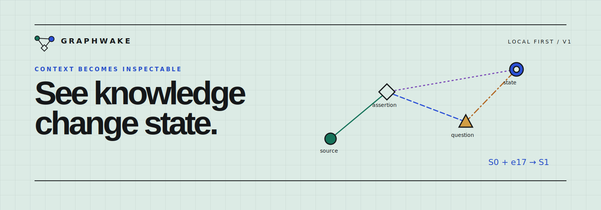

<p align="center">
  
</p>

# Graphwake

Graphwake is a local-first studio for building typed context, memory, and evidence graphs from one prompt. It records every accepted graph mutation in an append-only event ledger, reconstructs any prior state by replay, and exposes the method, inputs, formula, and caveat behind each computed insight.

- Run a deterministic local graph generator without an account or API key.
- Stream model-proposed mutations using your own OpenAI, Anthropic (Claude), or NEAR AI Cloud key, with the model chosen in the UI.
- Inspect objects, evidence, vectors, relation rationale, event hashes, and state hashes.
- Save projects in IndexedDB, replay their history, export verified JSON, and delete every local record.

Graphwake keeps application transitions, provenance, vector similarity, and causal hypotheses distinct. A model-stated reason is stored data, not hidden reasoning. A causal hypothesis is a claim, not proof.

## Run locally

Requirements: Node.js 20.19 or newer and npm.

```bash
git clone https://github.com/karimbabasf/graphwake.git
cd graphwake
npm install
npm run dev
```

Open [http://localhost:3000](http://localhost:3000). The local runner, manual editor, replay, insights, export, and persistence work with no environment variables.

## Optional AI models (bring your own key)

The AI runner uses your own provider key. Nothing is configured in the server environment; you enter a key in the UI, and it stays in the browser session (never in a project or export).

Pick a provider when you create a project (or from the studio's "AI model" dialog):

- **OpenAI** (`api.openai.com`): GPT and o-series models.
- **Claude (Anthropic)** (`api.anthropic.com`): Claude models. No embeddings, so the vector layer stays on the local projection.
- **NEAR AI Cloud** (`cloud-api.near.ai`): one key, a large private catalog (Claude, GPT, Gemini, Qwen, and more) plus embeddings.

The model list is fetched live from the provider with your key, so you choose from exactly what that key can reach. The key travels only to the same-origin API route, which forwards it to the provider for one request; it is never stored server-side. The application validates every proposal before writing it to IndexedDB.

For a public deployment, set `GRAPHWAKE_API_TOKEN` (at least 24 characters) to gate the AI routes, then enter that token in the studio's "AI model" dialog. Graphwake also checks request origin, bounds request bytes and model output, and applies a per-instance request limit. A distributed deployment still needs a platform-level quota.

```bash
cp .env.example .env.local
```

## Test

```bash
npm test
npm run typecheck
npm run lint
npm run build
```

Run the complete gate with `npm run check`.

Project data stays in the current browser profile. Export a project before clearing browser storage if you need to keep its ledger.

Runners execute only while the studio tab is open. After an unclean close, browsers with Web Locks record the abandoned run as interrupted on the next startup. Browsers without Web Locks leave that status untouched instead of guessing.

Licensed under the [MIT License](./LICENSE).
